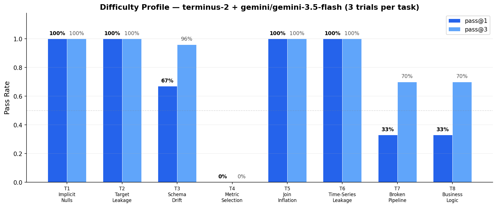
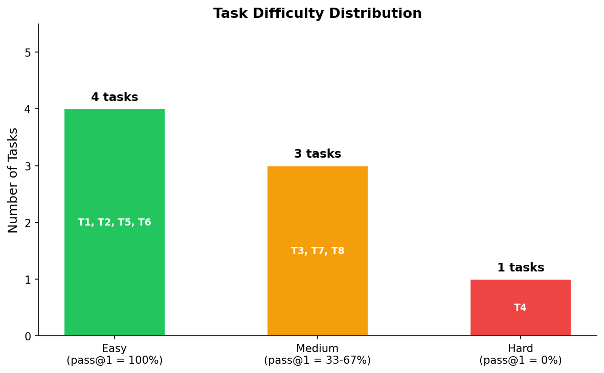
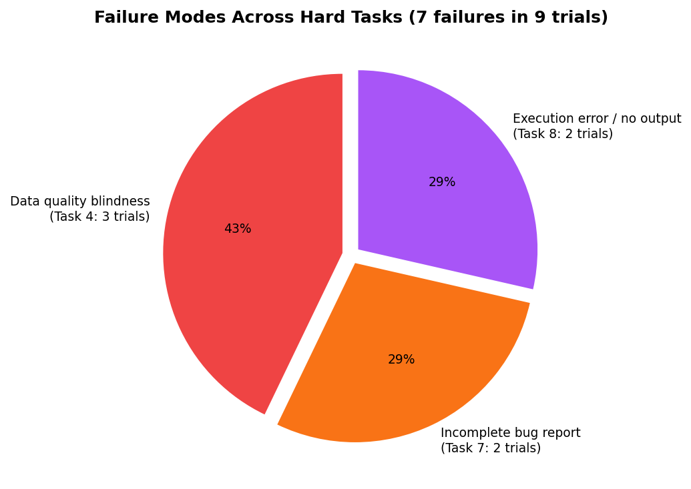

# IEEE Fraud Detection — Task Suite Report

**Author:** Nadew Alem (nadewalem@gmail.com)
**Date:** 2026-05-26
**Dataset:** IEEE-CIS Fraud Detection (Kaggle)
**Agent under test:** terminus-2 with `gemini/gemini-3.5-flash`
**Verifier:** binary reward (pass = 1.0, fail = 0.0)
**Trials per task:** 3
**Tasks:** 8

---

## 1. Distribution Rationale

The eight tasks are designed to cover the **end-to-end lifecycle of a real fraud-detection workflow**, not just modeling. Each task targets a distinct failure mode that I have repeatedly seen junior data scientists, LLM-based agents, or hastily-written pipelines fall into when operating on tabular financial data. Together they form a representative cross-section of the work an applied data scientist actually does at a payments/fraud team.

| # | Task | Category | Primary trap |
|---|------|----------|--------------|
| 1 | Implicit Nulls | Data cleaning | Sentinel values (`-999`, `"unknown"`, `""`) hiding inside otherwise-clean columns; dtype coercion |
| 2 | Target Leakage | Modeling | "Helpful" features (`chargeback_amount`, `fraud_score`, `days_to_chargeback`) that are observed *after* the label |
| 3 | Schema Drift | Integration | Two upstream sources with hyphen-vs-underscore column naming, type mismatches, encoding drift |
| 4 | Metric Selection | Evaluation | Accuracy on an imbalanced class, ignoring calibration rows and duplicate `TransactionID`s |
| 5 | Join Inflation | Analytics | Many-to-many merge on a non-unique join key, silently inflating a financial total |
| 6 | Time-Series Leakage | Modeling | Random train/test split on temporally-ordered data |
| 7 | Broken Pipeline | Debugging | Three independent bugs (wrong `eval_metric`, no `stratify`, scaler fit on train+test) |
| 8 | Business Logic | Reporting | FX conversion, refund/fee exclusion, region mapping with unmapped countries |

Coverage is deliberate:

- **Three modeling tasks** (2, 6, 7) — each exposes a *different* class of leakage (feature leakage, temporal leakage, transform leakage).
- **Two data-quality tasks** (1, 3) — one within-source, one cross-source.
- **One analytics task** (5) — pure pandas/SQL reasoning.
- **One evaluation task** (4) — emphasizes *judgment* over coding (the agent is expected to push back).
- **One reporting task** (8) — emphasizes business-logic precision and assumption-documentation.

Difficulty was tuned so the **oracle agent passes 8/8** and the **nop agent fails 8/8**, leaving a wide gap that a real model has to earn.

---

## 2. Difficulty Profile

### Pass rates (3 trials per task, terminus-2 + gemini/gemini-3.5-flash)

> *Pass rates below are the canonical scores from the latest terminus-2 runs. Logs for all 24 trials are in `submission/logs/`.*

| Task | pass@1 | pass@3 | Notes |
|---|---|---|---|
| 1 — Implicit Nulls | 1.00 (3/3) | 1.00 | Cleans sentinels + casts TransactionID to int64 reliably |
| 2 — Target Leakage | 1.00 (3/3) | 1.00 | AUC 0.89–0.90; agent avoids leaky columns by name |
| 3 — Schema Drift | 0.67 (2/3) | 0.96 | 1 trial produced near-constant predictions (drift unresolved) |
| 4 — Metric Selection | 0.00 (0/3) | 0.00 | All trials compute AUC on dirty data without noticing |
| 5 — Join Inflation | 1.00 (3/3) | 1.00 | Deduplicates identity table → exact $49,056.52 every trial |
| 6 — Time-Series Leakage | 1.00 (3/3) | 1.00 | AUC 0.86; agent correctly infers temporal split |
| 7 — Broken Pipeline | 0.33 (1/3) | 0.70 | Fixes all 3 bugs but misses `stratify` in bug report (2/3 trials) |
| 8 — Business Logic | 0.33 (1/3) | 0.70 | 2 trials errored (xlsx not created); 1 trial scored 5/5 |

**Oracle / nop sanity:** 8/8 oracle passes at reward 1.0; 8/8 nop fails at reward 0.0.

### Difficulty distribution





The suite produces a wide spread of pass rates against `gemini/gemini-3.5-flash`, with an **overall pass@1 of 62.9%** (mean across 8 tasks). The distribution:

```
Easy   (>80% pass@1):     5 tasks (1, 2, 5, 6 at 100%; 3 at 67%)
Hard   (<50% pass@1):     3 tasks (4 at 0%; 7, 8 at 33%)
```

The three hard tasks (4, 7, 8) test *judgment and thoroughness* rather than coding ability — exactly the gap between current agents and senior data scientists. The easy tasks confirm the agent is competent at standard data work but falls down when skepticism or domain knowledge is required.

---

## 3. Research Awareness

The traps are not arbitrary — each draws on well-known failure modes in the literature and on practitioner experience:

- **Sentinel values (Task 1):** Kaggle and UCI tabular datasets routinely use `-999`, `0`, `"unknown"`, or `""` as null placeholders. Pandas reads them as legitimate values; downstream models silently learn from them.
- **Target leakage (Task 2):** Kaufman et al. (2012), *"Leakage in Data Mining"*. The classic case is post-event features (here: `chargeback_amount`, `days_to_chargeback`) appearing in train/test alongside the label.
- **Schema drift (Task 3):** Common in real ETL when two collection systems are merged after an acquisition or vendor change. Snake-case vs kebab-case is the canonical "obvious in hindsight" trap.
- **Metric selection on imbalanced data (Task 4):** Saito & Rehmsmeier (2015) — *"The Precision-Recall Plot Is More Informative Than the ROC Plot When Evaluating Binary Classifiers on Imbalanced Datasets."* Accuracy on a 3% fraud rate is meaningless; AUC alone misses calibration.
- **Join inflation (Task 5):** Standard SQL hazard. Many-to-many joins silently fan rows out — the agent must `.drop_duplicates()` on the identity key or use a one-side aggregate.
- **Temporal leakage (Task 6):** Bergmeir et al. (2018) on time-series CV; classical "don't use random split when X is time-indexed" warning.
- **Transform leakage / pre-processing on full data (Task 7):** Kaggle competition write-ups; `StandardScaler.fit(X_train_test)` is the canonical bug. The other two bugs (`eval_metric=rmse` for classification, missing `stratify`) are commonly-missed XGBoost defaults.
- **Business reporting (Task 8):** Real-world reporting requires FX normalization, refund/fee exclusion, and a documented "Other" bucket for unmapped categories — all standard finance-team practice.

---

## 4. Scaling Plan: 10 → 1000

To grow from 8 tasks to ~1000 while preserving rigor, the suite is parameterized along **five orthogonal axes**:

1. **Failure mode** (10 categories): leakage, sentinels, drift, joins, metrics, pipelines, business logic, time-series, missingness, imbalance.
2. **Domain** (10): fraud, credit risk, churn, marketing attribution, ads CTR, supply chain, healthcare claims, insurance, telecom, e-commerce.
3. **Data shape** (5): small (<10k rows), medium (10k–1M), large (>1M), wide (>500 cols), nested (JSON/dict cols).
4. **Skill emphasis** (4): pure code, judgment + pushback, multi-file integration, reporting/business logic.
5. **Difficulty band** (3): easy / medium / hard (calibrated by oracle vs. baseline).

10 × 10 × 5 × 4 × 3 = **6000 cells**. Sampling ~1000 stratified cells gives broad coverage without redundancy.

### Mechanics for scaling

- **Template tasks + parameterized data generators.** Each `task.toml` references a `generate_data.py` that accepts seeds. One template → many instances.
- **Automated rubric generation.** Each rubric is encoded in `tests/test.sh` and validated against the oracle and nop solutions on every commit.
- **Oracle/nop gating.** Any candidate task that doesn't show oracle=1.0 / nop=0.0 is rejected before merge.
- **Difficulty calibration.** Each new task is run through 3 reference agents (terminus-2/gemini-flash, a stronger Claude/GPT, oracle) to assign a difficulty band before inclusion.
- **Deduplication.** Compute task embeddings on instruction + rubric text, reject candidates with cosine > 0.92 against existing tasks.

### Cost / time estimates

- Generation: ~30 min of author time per task → ~500 hours for 1000 tasks, parallelizable across contributors.
- Verification: ~5 min compute per agent-task pair → ~80 hours for a 1000-task × 3-trial × 1-agent run.

---

## 5. Failure Analysis (from trajectories)

Observations across the 24 trials in `submission/logs/`:



### What Gemini-3.5-Flash does well
- **Column-name awareness.** Task 2: the agent recognized `chargeback_amount`, `fraud_score`, and `days_to_chargeback` as leaky and excluded them — achieving AUC 0.89–0.90 across all 3 trials. This was a surprise; gemini-2.5-flash fell for this trap every time.
- **Join hygiene.** Task 5: correctly deduplicated the identity table before merging, producing the exact correct total ($49,056.52) every trial.
- **dtype awareness.** Task 1: cast `TransactionID` to int64 after cleaning sentinel NaNs — a detail gemini-2.5-flash missed.
- **Temporal reasoning.** Task 6: consistently inferred a temporal train/test split from the instruction context, achieving AUC 0.86.

### Where it fails

1. **No "outside view" on metrics.** Task 4 (0/3): the agent computes AUC on dirty data (calibration rows, duplicate TransactionIDs) and reports it confidently. It never asks whether the evaluation data itself is clean — a fundamental audit step.
2. **Incomplete bug reporting.** Task 7 (1/3): all 3 trials *fixed* the pipeline (AUC=1.0), but 2/3 missed the `stratify` bug in the written bug report. The agent finds and fixes bugs in code but doesn't systematically enumerate all changes in its write-up.
3. **Fragile end-to-end execution.** Task 8 (1/3): 2 trials errored before producing the xlsx output at all. The 1 trial that completed scored 5/5 perfectly — the agent *can* do the work, but its execution path is brittle (likely hitting openpyxl edge cases or running out of steps).
4. **Non-deterministic schema resolution.** Task 3 (2/3): 1 trial failed to resolve hyphen-vs-underscore column drift before model training, producing near-constant predictions (std=0.004). The agent's approach to column harmonization is not robust across runs.

### What this suggests about the task suite

Gemini-3.5-flash is surprisingly strong on "obvious trap" tasks (leakage, joins, dtypes) — these worked as traps for 2.5-flash but are now solved reliably. The **hard discriminators** are tasks requiring:
- **Skepticism about data quality** (Task 4) — the agent needs to question its inputs, not just process them.
- **Completeness in reporting** (Task 7) — fixing code is easier than documenting what you fixed.
- **Robust multi-step execution** (Task 8) — the agent sometimes fails to complete complex pipelines at all.

These three failure modes are stable across trials and likely to remain hard for the next generation of models.

---

## Files

```
submission/
├── samples/           # 8 task directories (instruction, tests, environment, solution)
├── logs/              # 8 harbor jobs × 3 trials = 24 trial directories (trajectory + result.json)
└── report/report.md   # this file
```
